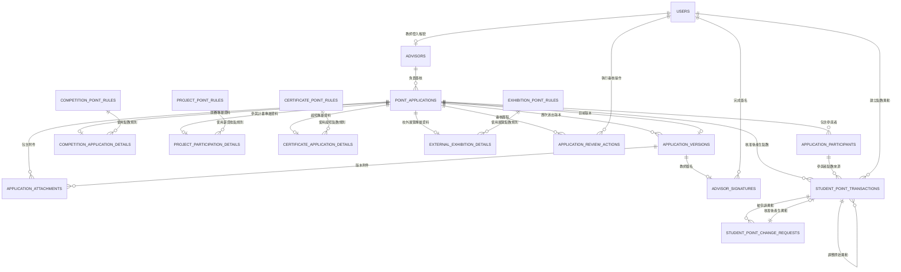

# 資料模型

本文件描述 PostgreSQL 邏輯資料模型、各資料表用途、欄位與關聯。共用 PostgreSQL 設計原則請參考 [Schema 設計規範](schema-conventions.md)；完整 SQL 請參考 [資料庫 Schema](database-schema.md)；點數計算、規則與流水帳請參考 [點數系統](point-system.md)。

## 資料關聯總覽



## 使用者帳號 `users`

提供指導老師、承辦人與管理員登入系統。申請人不需要帳號，因此不會存在於這張資料表。

| 欄位 | 說明 |
| --- | --- |
| `id` | 主鍵 |
| `display_name` | 使用者顯示名稱，用於通知與稽核紀錄 |
| `email` | 登入帳號與系統通知信箱 |
| `password_hash` | 雜湊後的密碼，完成首次設定前可為 `NULL` |
| `role` | 使用者角色 |
| `is_active` | 帳號是否啟用 |
| `activation_token_hash` | 帳號啟用 Token 的雜湊值，可為 `NULL` |
| `activation_token_expires_at` | 帳號啟用連結到期時間，可為 `NULL` |
| `activated_at` | 完成首次帳號啟用的時間，可為 `NULL` |
| `password_reset_token_hash` | 密碼重設 Token 的雜湊值，可為 `NULL` |
| `password_reset_token_expires_at` | 密碼重設連結到期時間，可為 `NULL` |
| `last_login_at` | 最後登入時間，可為 `NULL` |
| `created_at` | 建立時間 |
| `updated_at` | 修改時間 |

`role` 預計值：

- `advisor`：指導老師
- `reviewer`：承辦人
- `admin`：系統管理員

資料規則：

- 每個帳號只能擁有一個角色。
- 系統可以存在多位指導老師及多位承辦人。
- 同一時間只能存在一位 `role = admin` 且 `is_active = true` 的管理員。
- 帳號不可刪除，只能停用，以保留歷史操作關聯。

帳號狀態判斷：

- `activated_at IS NULL`：尚未完成首次帳號啟用。
- `activated_at IS NOT NULL AND is_active = TRUE`：已完成啟用，目前可以登入。
- `activated_at IS NOT NULL AND is_active = FALSE`：曾經完成啟用，但後來被管理員停用。

## 指導老師 `advisors`

保存可供申請人從下拉選單選擇的指導老師資料，並將教師資料與登入帳號建立關聯。

| 欄位 | 說明 |
| --- | --- |
| `id` | 主鍵 |
| `user_id` | 關聯 `users.id`，且必須唯一 |
| `employee_number` | 教師編號，必須唯一 |
| `name` | 教師姓名 |
| `title` | 職稱 |
| `department` | 所屬系所或單位 |
| `is_director` | 是否為目前主任，預設為 `false` |
| `is_active` | 是否可被選擇，預設為 `true` |
| `created_at` | 建立時間 |
| `updated_at` | 修改時間 |

教師的登入及通知 Email 原則上使用 `users.email`，避免在 `advisors` 重複保存 Email。

教師離職、停職或暫時不可選擇時，應將 `is_active` 設為 `false`，而不是刪除教師資料，以保留歷史申請關聯。

主任仍使用指導老師帳號登入，`is_director` 只表示該教師目前兼任主任，不代表額外的審核角色。

帳號與身分關聯規則：

- `user_id` 必須為 `NOT NULL` 且唯一，確保每位指導老師都有對應的登入帳號，且一個帳號不會同時對應多位老師。
- 對應的 `users.role` 必須為 `advisor`，由 Service 層在建立及修改時驗證。
- 管理員建立指導老師時，必須在同一個 PostgreSQL Transaction 中完成 `users` 與 `advisors` 的建立，避免出現有 `users` 紀錄但缺少 `advisors` 對應的中間狀態。

主任資料規則：

- 系統同一時間最多只能有一位 `is_active = true` 且 `is_director = true` 的主任。
- 使用 partial unique index 限制只能存在一位啟用中的主任。
- 主任異動時，將舊主任的 `is_director` 設為 `false`，再將新主任設為 `true`，不可刪除舊主任資料。
- 主任異動兩步操作必須在同一個 PostgreSQL Transaction 中完成，避免短暫出現兩位主任或無主任的狀態。
- 申請核准後，系統使用主任所關聯的 `users.email` 寄送核准通知。
- 主任僅接收核准通知與備份，不需要再次核准或簽名。

下拉選單可被選的判斷條件：

申請表單只顯示同時符合下列條件的指導老師：

```sql
advisors.is_active = TRUE
AND users.is_active = TRUE
AND users.activated_at IS NOT NULL
```

未完成首次帳號啟用的教師即使 `advisors.is_active = true`，也不會出現在選單中，避免申請人選到無法簽名的老師。

建議索引：

```sql
CREATE UNIQUE INDEX one_active_director
ON advisors (is_director)
WHERE is_director = TRUE AND is_active = TRUE;
```

## 點數申請 `point_applications`

保存所有申請類型共用的核心資料。一筆資料代表一次完整的點數申請。

| 欄位 | 說明 |
| --- | --- |
| `id` | 主鍵 |
| `public_id` | 對外申請識別值，使用 UUID，必須唯一 |
| `application_type` | 申請類型 |
| `status` | 目前申請狀態 |
| `advisor_id` | 關聯 `advisors.id` |
| `applicant_name` | 申請人姓名 |
| `applicant_email` | 申請人通知 Email，必須為正規化後（trim + lowercase）格式 |
| `applicant_phone` | 申請人聯絡電話 |
| `requested_total_points` | 所有參與者申請點數的加總，必須大於或等於 `0` |
| `approved_total_points` | 所有參與者核准點數的加總，審核前為 `NULL`，核准後必須大於或等於 `0` |
| `current_version_id` | 目前申請版本，關聯 `application_versions.id`；首次建立 Transaction 中暫時為 `NULL` |
| `edit_token_hash` | 補件連結 Token 的雜湊值，可為 `NULL` |
| `edit_token_expires_at` | 補件連結到期時間，可為 `NULL` |
| `submitted_at` | 首次送件時間 |
| `closed_at` | 申請流程結束時間，未進入終止狀態前為 `NULL` |
| `created_at` | 建立時間 |
| `updated_at` | 修改時間 |

申請人三件套（`applicant_name`、`applicant_email`、`applicant_phone`）皆為 `NOT NULL`。申請建立等同於送件，沒有草稿階段，因此 `submitted_at` 在首次建立時等於 `created_at`，但保留獨立欄位以便清楚標示業務意涵，並作為點數規則版本查詢依據。

`closed_at` 代表申請流程結束時間。當 `status` 為終止狀態 `approved` 或 `rejected` 時，`closed_at` 必須有值；當 `status` 仍為 `pending_advisor`、`under_review` 或 `needs_revision` 時，`closed_at` 必須為 `NULL`。狀態與 `closed_at` 的配對由 PostgreSQL `CHECK` constraint 保證。

`edit_token_hash` 與 `edit_token_expires_at` 必須同時為 `NULL` 或同時非 `NULL`，由 PostgreSQL `CHECK` constraint 保證。補件 Token 雜湊使用 `BYTEA`，與 `users` 的啟用與密碼重設 Token 相同處理方式，並建立非 `NULL` 值的 Partial Unique Index 防止 Token 撞號並加速查詢。

`applicant_email` 在寫入前必須移除前後空白並轉為小寫，但**不建立唯一索引**，因為同一位申請人可以重複建立多筆申請。

### 申請類型

`application_type` 用來決定：

- 前端顯示哪一種申請表單。
- 後端使用哪一組欄位驗證與業務規則。
- 需要建立哪一張申請類型專屬資料。
- 審核頁面需要顯示哪些資訊。

目前預計類型：

- `competition`：競賽點數申請
- `certificate`：證照點數申請
- `project_participation`：參與計畫點數申請
- `external_exhibition`：參加校外展覽點數申請

`status` 可使用的值與狀態轉換規則請參考 [產品流程](product-workflows.md#申請狀態)。

## 申請參與者 `application_participants`

保存實際參與活動並取得點數的學生。系統不建立學生主資料庫，因此參與者資料全部由申請人手動填寫。

| 欄位 | 說明 |
| --- | --- |
| `id` | 主鍵 |
| `application_id` | 關聯 `point_applications.id`，搭配 `student_number` 必須唯一 |
| `class_name` | 班級 |
| `student_number` | 學號，同一申請內不可重複 |
| `student_name` | 姓名 |
| `requested_points` | 申請人為此參與者填寫的申請點數，必須大於 `0` |
| `approved_points` | 承辦人核准的最終點數，審核前為 `NULL`，核准時必須大於或等於 `0`（允許為 `0`） |
| `is_applicant` | 是否為本次申請人，預設為 `false` |
| `created_at` | 建立時間 |
| `updated_at` | 修改時間 |

`application_id`、`class_name`、`student_number`、`student_name`、`requested_points` 與 `is_applicant` 皆為 `NOT NULL`；`approved_points` 在核准前為 `NULL`。

跨資料表加總一致性規則：

- 所有參與者的 `requested_points` 加總，必須等於 `point_applications.requested_total_points`。
- 所有參與者的 `approved_points` 加總，必須等於 `point_applications.approved_total_points`。
- 上述加總一致性無法以 `CHECK` 表達，必須由 Service 在同一個 PostgreSQL Transaction 中驗證並寫入。

申請人身分規則：

- 每筆申請至少需要一位參與者，且必須剛好有一位 `is_applicant = TRUE` 的參與者。
- `is_applicant = TRUE` 的 `student_name` 必須與 `point_applications.applicant_name` 一致，由 Service 在 Transaction 內驗證，資料庫層不建立跨表 Trigger。
- 使用 partial unique index 限制每筆申請最多只能有一位申請人；至少需要一位申請人的條件由 Service 與 Zod 驗證保證。

補件版本處理：

- 補件時申請人可能修改參與者名單、學號或點數分配。
- `application_participants` 採就地 `UPDATE`／`DELETE`／`INSERT`，只反映目前最新版本的參與者。
- 完整歷史依賴 `application_versions.application_snapshot` 保留每次送件時的快照，`application_participants` 表本身不維護版本歷史。
- 補件操作會更新資料列，因此 `updated_at` 必須掛上共用 `set_updated_at()` Trigger。
- `student_point_transactions.participant_id` 永遠指向目前版本的參與者列；只有核准後才會建立點數異動，補件中途的參與者列不會產生點數紀錄。

核准後規則：

- 核准完成後，`approved_points` 不可再修改；後續更正必須走 `student_point_change_requests` 流程。

建議使用 partial unique index，限制每筆申請只能有一位申請人：

```sql
CREATE UNIQUE INDEX one_applicant_per_application
ON application_participants (application_id)
WHERE is_applicant = TRUE;
```

同時建立同一申請內學號的唯一限制：

```sql
ALTER TABLE application_participants
ADD CONSTRAINT application_participants_application_student_unique
UNIQUE (application_id, student_number);
```

額外建立 `UNIQUE (id, application_id)`，供 `student_point_transactions` 的複合外鍵使用，保證流水帳的 `participant_id` 與 `application_id` 屬於同一筆申請：

```sql
ALTER TABLE application_participants
ADD CONSTRAINT application_participants_id_application_unique
UNIQUE (id, application_id);
```

此 UNIQUE 在語意上是冗餘的（`id` 為 PK 已自然唯一），但 PostgreSQL 需要顯式 UNIQUE 才能作為複合外鍵的目標。

## 競賽申請資料 `competition_application_details`

保存只有競賽點數申請才會使用的資料，與 `point_applications` 為一對一關係。

| 欄位 | 說明 |
| --- | --- |
| `id` | 主鍵 |
| `application_id` | 關聯 `point_applications.id`，且必須唯一 |
| `competition_level_requested` | 申請人填寫的競賽等級 |
| `competition_level_other` | 申請人選擇其他競賽等級時填寫，可為 `NULL` |
| `competition_level_approved` | 承辦人最終認定的競賽等級，審核前為 `NULL` |
| `competition_level_approved_other` | 承辦人最終認定為其他競賽等級時填寫，可為 `NULL` |
| `competition_point_rule_id` | 送件時適用的競賽點數規則，關聯 `competition_point_rules.id` |
| `competition_name` | 競賽名稱 |
| `competition_category` | 競賽類別 |
| `award` | 獎項 |
| `award_other` | 選擇其他獎項時填寫，可為 `NULL` |
| `competition_date` | 競賽日期 |
| `created_at` | 建立時間 |
| `updated_at` | 修改時間 |

競賽等級預計選項：

- `international_integrated`：國際級整合
- `international_non_integrated`：國際級非整合
- `national_integrated`：全國性整合
- `national_non_integrated`：全國性非整合
- `other`：其他

選擇 `other` 競賽等級時，`competition_level_other` 必填；選擇其他競賽等級時，`competition_level_other` 必須為 `NULL`。

核准時，`competition_level_approved` 必須保存承辦人的最終認定等級。若最終認定為 `other`，`competition_level_approved_other` 必填；認定為其他等級時，`competition_level_approved_other` 必須為 `NULL`。

獎項預計選項：

- `first_place`：第一名
- `second_place`：第二名
- `third_place`：第三名
- `honorable_mention`：佳作
- `other_award`：其他獎項
- `finalist`：入圍
- `participation`：參賽

選擇 `other_award` 時，`award_other` 必填；選擇其他獎項時，`award_other` 必須為 `NULL`。

承辦人若只是依點數規則將競賽等級從申請人主張的 A 級認定為 B 級，可以直接填寫 `competition_level_approved` 並調整核准點數，不需要退回補件。原始申請等級與申請點數必須保留。

## 參與計畫申請資料 `project_participation_details`

保存參與計畫申請的專屬資料，與 `point_applications` 為一對一關係。

| 欄位 | 說明 |
| --- | --- |
| `id` | 主鍵 |
| `application_id` | 關聯 `point_applications.id`，且必須唯一 |
| `project_point_rule_id` | 送件時適用的薪資換點規則，關聯 `project_point_rules.id` |
| `project_name` | 計畫名稱 |
| `principal_investigator` | 計畫主持人 |
| `salary_start_month` | 領薪開始年月 |
| `salary_end_month` | 領薪結束年月 |
| `monthly_salary` | 薪資金額 |
| `work_description` | 工作概述 |
| `total_salary` | 領薪總金額，建議由系統計算 |
| `calculated_points` | 依規則計算出的參考點數 |
| `created_at` | 建立時間 |
| `updated_at` | 修改時間 |

資料規則：

- 一張申請只允許一位參與者，且該參與者必須是申請人，由 Service 在 Transaction 內驗證。
- 一張申請只能包含一個計畫；不同計畫必須分開申請。
- `salary_start_month` 與 `salary_end_month` 固定保存該月份第一天（依 [Schema 設計規範](schema-conventions.md#時間與日期)），並由資料庫 CHECK 強制 `EXTRACT(DAY FROM ...) = 1`。
- `salary_end_month` 必須大於或等於 `salary_start_month`。
- `monthly_salary` 為新台幣元整數（`BIGINT`），必須大於 `0`。
- `total_salary` 與 `calculated_points` 原則上由系統依規則計算，不由申請人手動輸入。
- 不同計畫的薪資不可合併後再計算點數；各計畫分別建立申請，核准後由學生點數流水帳依學號加總。

## 證照申請資料 `certificate_application_details`

保存取得證照申請的專屬資料，與 `point_applications` 為一對一關係。

| 欄位 | 說明 |
| --- | --- |
| `id` | 主鍵 |
| `application_id` | 關聯 `point_applications.id`，且必須唯一 |
| `certificate_point_rule_id` | 送件時適用的證照點數規則，關聯 `certificate_point_rules.id` |
| `certificate_name` | 證照名稱 |
| `issuing_organization` | 發照單位 |
| `certificate_number` | 證照編號 |
| `issued_date` | 證照日期 |
| `created_at` | 建立時間 |
| `updated_at` | 修改時間 |

資料規則：

- 一張證照固定申請 `2` 點。
- 申請點數應由系統自動設定，不由申請人手動輸入。
- 每位學生在整個在學期間，證照類別累積最高只能取得 `4` 點。
- 若學生證照類累積點數已達 `4` 點，本次證照申請不可核准。
- 每張證照固定 `2` 點，因此超過累積上限時不進行部分核准。

## 校外展覽申請資料 `external_exhibition_details`

保存參加校外展覽申請的專屬資料，與 `point_applications` 為一對一關係。

| 欄位 | 說明 |
| --- | --- |
| `id` | 主鍵 |
| `application_id` | 關聯 `point_applications.id`，且必須唯一 |
| `exhibition_point_rule_id` | 送件時適用的展覽點數規則，關聯 `exhibition_point_rules.id` |
| `exhibition_type` | 展覽類型 |
| `work_name` | 作品名稱 |
| `exhibition_name` | 展覽名稱選項 |
| `exhibition_name_other` | 選擇其他展覽時填寫，可為 `NULL` |
| `organizer` | 主辦單位 |
| `venue` | 展覽場地 |
| `start_date` | 展覽開始日期 |
| `end_date` | 展覽結束日期 |
| `created_at` | 建立時間 |
| `updated_at` | 修改時間 |

展覽類型預計選項：

- `creative_work`：創作作品
- `graduation_project_exhibition`：畢業專題展覽

展覽名稱預計選項：

- `campus_exhibition`：校內展
- `young_designers_exhibition`：青春設計節
- `vision_get_wild`：放視大賞
- `young_designers_exhibition_taiwan`：新一代設計展
- `a_plus_creative_festival`：A+ 創意季
- `moe_project_competition`：教育部專題競賽
- `other`：其他

選擇 `other` 時，`exhibition_name_other` 必填；選擇其他展覽名稱時，`exhibition_name_other` 必須為 `NULL`。

展覽日期拆分為 `start_date` 與 `end_date`，不要保存為日期範圍字串。

目前點數規則：

- 創作作品：每位參與者可申請 `0.5` 至 `1` 點。
- 畢業專題展覽：每位參與者可申請 `1` 至 `2` 點。
- 申請人填寫申請點數，承辦人可以在核准前調整最終核准點數。

## 申請附件 `application_attachments`

所有申請類型共用的附件資料表。一筆申請可以包含多個附件，附件不直接保存於各類型的專屬資料表。

附件不會在送出申請前單獨上傳或寫入資料庫。申請資料與附件會在同一次送出流程中建立；只有整份申請成功建立後，才會保存附件紀錄。因此第一版不需要暫存附件資料表或附件清理流程。

| 欄位 | 說明 |
| --- | --- |
| `id` | 主鍵 |
| `public_id` | 對外附件識別值，使用 UUID，必須唯一 |
| `application_id` | 關聯 `point_applications.id` |
| `application_version_id` | 關聯 `application_versions.id`，表示附件屬於哪一版申請 |
| `attachment_type` | 附件類型，例如獎狀、證照或薪資證明 |
| `attachment_type_other` | 選擇其他附件類型時填寫，可為 `NULL` |
| `description` | 附件補充說明，可為 `NULL` |
| `original_filename` | 上傳時的原始檔名，使用 `VARCHAR(255)` |
| `storage_key` | 私有檔案儲存識別值，使用 `TEXT` |
| `mime_type` | 檔案格式，使用 `VARCHAR(100)` |
| `file_size` | 檔案大小（位元組），使用 `BIGINT` |
| `uploaded_at` | 上傳時間（業務語意欄位） |
| `created_at` | 建立時間（資料列建立時間，與 `uploaded_at` 同步寫入） |

`application_attachments` 屬於不可變紀錄，**沒有 `updated_at` 欄位，不掛 `set_updated_at()` Trigger**。

附件實體檔案放在私有儲存空間，資料庫只保存 `storage_key`。檔案必須經過登入及權限驗證後才能下載。

補件版本處理：

- 附件採**每版本一筆 row** 的設計，補件保留舊附件時 **INSERT 新一筆**，沿用同一 `storage_key`、`original_filename`、`mime_type` 與 `file_size`；只有 `application_version_id` 與 `public_id` 不同。
- 補件新上傳的附件 INSERT 新 row、新 `storage_key`。
- 舊版本對應的附件 row 保持不變，不會被刪除或修改。
- 因此同一個 `storage_key` 可能對應多筆 attachment row（每版本一筆），但 `application_version_id` 永遠指向附件屬於的特定版本。
- 此設計讓 `application_attachments` 成為「所有版本附件的完整歷史」，與 `application_versions.application_snapshot` 「不含附件」的決策相互支撐。

跨表完整性：

- 使用複合外鍵 `FOREIGN KEY (application_version_id, application_id) REFERENCES application_versions (id, application_id)`，確保附件的 `application_version_id` 確實屬於同一筆 `application_id`，由資料庫保證一致性。
- 同一版本內不會出現兩筆指向同一 `storage_key` 的附件 row，由 `UNIQUE (application_version_id, storage_key)` 限制。

附件數量上限（每筆申請最多 10 個）由 Service 在送件 Transaction 內用 `SELECT ... FOR UPDATE` 計數驗證，資料庫層不建立跨資料列 CHECK。

附件類型預計值：

- `competition_rules`：競賽辦法
- `competition_poster`：競賽海報
- `official_website_screenshot`：官網截圖
- `official_document`：公文
- `participation_proof`：參賽證明
- `finalist_or_award_certificate`：入圍或獎狀
- `salary_proof`：薪資證明或薪資截圖
- `certificate_copy`：證照影本
- `exhibition_photo`：參加展覽照片
- `exhibition_poster`：展覽海報
- `other`：其他附件

選擇 `other` 時，`attachment_type_other` 必填；選擇其他附件類型時，`attachment_type_other` 必須為 `NULL`。`description` 可用於補充附件用途，例如「競賽官網得獎名單頁面」。

第一版允許的檔案格式：

- `application/pdf`
- `image/jpeg`
- `image/png`

第一版不允許 ZIP、RAR 等壓縮檔，避免無法預覽、內容格式難以控制、路徑穿越與壓縮炸彈等安全風險。

檔案限制與安全規則：

- 每筆申請最多 `10` 個附件。
- 每個檔案最多 `5 MB`。
- 上傳時必須同時檢查副檔名、MIME type 與實際檔案內容。
- 儲存時使用 UUID 重新命名，不直接使用原始檔名作為儲存路徑。

各申請類型最低附件要求：

- 競賽申請：`participation_proof` 或 `finalist_or_award_certificate` 至少一份。
- 參與計畫申請：`salary_proof` 至少一份。
- 證照申請：`certificate_copy` 至少一份。
- 校外展覽申請：`exhibition_photo` 至少一份。

## 審核操作紀錄 `application_review_actions`

保存每次同意、拒絕、要求補件、重新提交及核准操作。這張資料表是審核歷史紀錄，不只用於補件或拒絕。

| 欄位 | 說明 |
| --- | --- |
| `id` | 主鍵 |
| `application_id` | 關聯 `point_applications.id` |
| `actor_user_id` | 操作者帳號，關聯 `users.id`；申請人操作時可為 `NULL` |
| `actor_type` | 操作者類型 |
| `action_type` | 執行的審核動作 |
| `reason` | 補件與拒絕原因，其他操作可為 `NULL` |
| `metadata` | 審核調整的結構化資料，使用 PostgreSQL `JSONB` |
| `ip_address` | 操作來源 IP |
| `user_agent` | 操作使用的瀏覽器資訊 |
| `created_at` | 操作時間 |

`actor_type` 與 `action_type` 都是 `application_review_actions` 的欄位。下列項目是欄位可使用的值，不是獨立資料表或欄位。

`actor_type` 預計值：

| 值 | 說明 |
| --- | --- |
| `advisor` | 操作者是指導老師 |
| `reviewer` | 操作者是承辦人 |
| `applicant` | 操作者是沒有系統帳號的申請人 |
| `system` | 操作者是背景排程或系統自動流程 |

`action_type` 預計值：

| 值 | 說明 | `reason` 是否必填 |
| --- | --- | --- |
| `advisor_approved` | 指導老師簽名同意申請 | 否 |
| `advisor_rejected` | 指導老師拒絕申請 | 是 |
| `revision_requested` | 承辦人要求申請人補件 | 是 |
| `resubmitted` | 申請人完成補件並重新提交 | 否 |
| `reviewer_approved` | 承辦人核准申請（可能含調整） | 若 `metadata` 含調整則必填 |
| `reviewer_rejected` | 承辦人拒絕申請 | 是 |
| `revision_expired` | 申請人未於補件期限內重新提交，系統將申請作廢 | 是 |
| `advisor_confirmation_expired` | 指導老師於期限內未完成簽核，系統將申請作廢 | 是 |

承辦人核准採「一次核准 = 一筆 `reviewer_approved`」設計，若該次核准包含等級或點數調整，將調整內容寫入 `metadata`，並必須填寫 `reason`。不再保留 `reviewer_adjusted` 作為獨立 action，避免「調整」與「核准」事件流分離造成混淆。

資料規則：

- 必填 `reason` 的 action：`advisor_rejected`、`revision_requested`、`reviewer_rejected`、`revision_expired`、`advisor_confirmation_expired`，由資料庫 `CHECK` 保證。
- `reviewer_approved` 若 `metadata` 含調整資料，`reason` 必填，由 Service 在 Transaction 內驗證。
- `metadata` 可保存競賽等級、參與者點數及申請總點數的調整前後資料；無調整時為 `NULL`。
- `actor_user_id` 與 `actor_type` 必須配對：`actor_type` 為 `advisor` 或 `reviewer` 時 `actor_user_id` 不可為 `NULL`；`actor_type` 為 `applicant` 或 `system` 時 `actor_user_id` 必須為 `NULL`，由資料庫 `CHECK` 保證。
- `ip_address` 與 `user_agent` 在 `actor_type = 'system'` 時為 `NULL`（背景排程沒有 request 來源），其他 `actor_type` 必須非 `NULL`，由資料庫 `CHECK` 保證。
- 申請人重新提交時，`actor_type` 為 `applicant`，`actor_user_id` 為 `NULL`，但仍須記錄瀏覽器 IP 與 UA。
- 系統自動作廢申請時，`actor_type` 為 `system`，`actor_user_id`、`ip_address` 與 `user_agent` 皆為 `NULL`。
- 每次要求補件與重新提交都新增紀錄，不覆蓋舊紀錄。
- 承辦人不需要電子簽名，登入帳號、操作時間、IP 與瀏覽器資訊作為責任追蹤依據。
- 承辦人核准前，系統應顯示最終核准資料與確認畫面。
- 承辦人拒絕、要求補件或調整點數時，必須填寫原因。
- 申請核准後不可直接修改結果，只能透過點數流水帳新增調整或沖銷紀錄。
- `application_review_actions` 屬於不可變稽核紀錄，沒有 `updated_at`，不掛 `set_updated_at()` Trigger。

調整紀錄範例：

```json
{
  "adjustments": {
    "competitionLevel": {
      "requested": "A",
      "approved": "B"
    },
    "participants": [
      {
        "participantId": 10,
        "requestedPoints": 20,
        "approvedPoints": 10
      }
    ],
    "totalPoints": {
      "requested": 20,
      "approved": 10
    }
  }
}
```

## 申請版本 `application_versions`

保存申請每次正式送出時的完整內容。首次提交與每次補件重新提交，都會建立一筆新的版本紀錄。

| 欄位 | 說明 |
| --- | --- |
| `id` | 主鍵 |
| `application_id` | 關聯 `point_applications.id` |
| `version_number` | 此版本編號，使用 `SMALLINT`，必須大於或等於 `1` |
| `application_snapshot` | 此版本送出時的完整申請資料，使用 PostgreSQL `JSONB` |
| `created_at` | 此版本建立時間 |

`application_versions` 屬於不可變的歷史紀錄，**沒有 `updated_at` 欄位，不掛 `set_updated_at()` Trigger**。版本一旦建立就不可修改或刪除。

`application_snapshot` 是某個時間點的完整申請資料副本，由 Service 在送件 Transaction 內寫入。**最小欄位集合**：

```json
{
  "applicant": {
    "name": "string",
    "email": "string（已 normalize）",
    "phone": "string"
  },
  "advisorId": 123,
  "applicationType": "competition | certificate | project_participation | external_exhibition",
  "typeDetails": {
    // 對應類型專屬表的欄位快照
  },
  "participants": [
    {
      "classNumber": "string",
      "studentNumber": "string",
      "studentName": "string",
      "requestedPoints": "number",
      "isApplicant": "boolean"
    }
  ],
  "requestedTotalPoints": "number"
}
```

`application_snapshot` **不包含**：

- 承辦人的審核結果（`approved_*` 欄位）：這些是審核之後的決定，不屬於送件當下，保存於目前資料表與 `application_review_actions`。
- 附件 metadata：附件由 `application_attachments` 表負責，透過 `application_version_id` 對應版本，避免雙寫造成不一致。需要列出某版本的附件時以 SQL JOIN 取得。

由於 `application_snapshot` 是凍結的歷史副本，未來如果資料模型欄位變動，舊版本快照**不需要 migration**；讀取舊版本時應容忍欄位缺失或結構差異，以快照當下的內容為準。

正常資料表保存目前最新內容；`application_versions` 則保存每次送出時的歷史內容，避免補件修改後覆蓋舊版本。

承辦人的核准點數與認定調整發生在申請送出之後，因此不寫入申請版本快照，而是保存於目前資料與 `application_review_actions` 審核紀錄。

資料規則：

- 首次送出時，建立 `version_number = 1` 的版本，並將 `point_applications.current_version_id` 指向該版本。
- 每次補件重新提交時，建立下一個 `version_number` 的版本，並將 `current_version_id` 更新為新版本的 ID。
- `current_version_id` 必須指向同一筆申請所擁有的版本紀錄。
- 同一筆申請不可有重複版本編號，應建立 `UNIQUE (application_id, version_number)`。
- 已建立的版本快照不可修改或刪除。
- 指導老師簽名必須關聯到特定申請版本。
- 建立或切換目前版本時，必須在同一個 PostgreSQL Transaction 中完成申請版本建立與 `current_version_id` 更新。

`current_version_id` 用來快速取得目前正在審核的完整版本紀錄；`application_versions.version_number` 則用來表示各歷史版本的順序。

### 目前版本關聯

`point_applications.current_version_id` 保存的是 `application_versions.id`，不是 `version_number`。它用來快速取得目前正在審核的完整版本；`version_number` 則表示同一申請內的歷史版本順序。

`current_version_id` 必須指向同一筆申請所擁有的版本。實際複合外鍵與首次建立 Transaction 請參考 [資料庫 Schema](database-schema.md#申請與版本的循環外鍵)。

## 指導老師簽名 `advisor_signatures`

保存指導老師每次同意申請時的簽名，以及老師所同意的特定申請版本。

| 欄位 | 說明 |
| --- | --- |
| `id` | 主鍵 |
| `application_version_id` | 關聯 `application_versions.id` |
| `advisor_user_id` | 簽名教師帳號，關聯 `users.id`（實際登入並完成簽名的人） |
| `signature_storage_key` | 私有簽名檔案的儲存識別值，使用 `TEXT` |
| `signed_at` | 簽名時間（業務語意欄位） |
| `invalidated_at` | 簽名失效時間，可為 `NULL` |
| `invalidated_reason` | 簽名失效原因，可為 `NULL`，使用 `TEXT` 自由文字 |
| `ip_address` | 簽名操作來源 IP，使用 `INET` |
| `user_agent` | 簽名操作的瀏覽器資訊，使用 `TEXT` |
| `created_at` | 建立時間（資料列建立時間，與 `signed_at` 同步寫入） |

`advisor_signatures` 沒有 `updated_at` 欄位，**不掛 `set_updated_at()` Trigger**。簽名建立後，唯一可能的修改是「標記失效」，該操作已由 `invalidated_at` 紀錄，不需要額外 `updated_at`。

資料規則：

- 指導老師必須登入系統後才能簽名。
- 指導老師收到通知連結後，登入成功應直接導向指定申請的簽核頁面。
- 老師拒絕申請時不需要簽名，但必須填寫拒絕原因。拒絕由 `application_review_actions.advisor_rejected` 紀錄，不寫入 `advisor_signatures`。
- 老師同意申請時，必須確認申請內容並完成簽名。
- 每次簽名建立新紀錄，新版本要簽名就 INSERT 一筆新的 `advisor_signatures`；新簽名不會覆蓋既有紀錄。
- 申請人完成補件後，**舊簽名以 UPDATE 方式標記失效**：設定 `invalidated_at` 與 `invalidated_reason`，不會 INSERT 失效紀錄、也不會刪除原本的簽名。每個版本因此最多只有一筆 `advisor_signatures`。
- `application_version_id` 用來證明老師簽名時實際同意的申請內容。
- `advisor_user_id` 對應的 `users` 帳號必須是該申請的指導老師（透過 `advisors.user_id` ↔ `point_applications.advisor_id` 比對），由 Service 在 Transaction 內驗證。
- `ip_address` 與 `user_agent` 必填（NOT NULL），作為稽核完整性的基礎。
- `invalidated_at` 與 `invalidated_reason` 必須同時為 `NULL` 或同時非 `NULL`，由 `CHECK` 保證。
- 簽名板固定輸出 PNG，後端必須驗證實際檔案格式，並使用 `.png` 儲存。
- 簽名圖片屬於敏感資料，不應以公開靜態網址提供，必須透過權限驗證後存取。

每個版本最多只能有一筆有效簽名，透過 partial unique index 限制：

```sql
CREATE UNIQUE INDEX one_valid_signature_per_version
ON advisor_signatures (application_version_id)
WHERE invalidated_at IS NULL;
```

`signature_storage_key` 不保存公開網址或作業系統絕對路徑。例如：

```text
signatures/applications/100/version-2/550e8400.png
```

後端會根據 Storage Key 從私有本機目錄、S3、MinIO 或其他物件儲存空間取得簽名檔案。

## 競賽點數規則 `competition_point_rules`

保存競賽等級與獎項對應的點數規則。實際點數對應表、計算驗證流程與管理員操作請參考 [點數系統 - 競賽點數規則](point-system.md#競賽點數規則-competition_point_rules)。

| 欄位 | 說明 |
| --- | --- |
| `id` | 主鍵 |
| `competition_level` | 競賽等級 |
| `award` | 獎項 |
| `allocation_method` | 點數分配方式 |
| `points` | 每人固定點數或團隊可分配總點數，必須大於或等於 `0` |
| `effective_from` | 規則生效日期 |
| `effective_to` | 規則失效日期，可為 `NULL` |
| `created_at` | 建立時間 |
| `updated_at` | 修改時間 |

`competition_level` 允許值（CHECK 限制）：

- `international_integrated`
- `international_non_integrated`
- `national_integrated`
- `national_non_integrated`
- `other`

`award` 允許值（CHECK 限制）：

- `first_place`
- `second_place`
- `third_place`
- `honorable_mention`
- `other_award`
- `finalist`
- `participation`

`allocation_method` 允許值（CHECK 限制）：`per_person`、`shared_total`。

資料規則：

- 規則生命週期完全由 `effective_from` 與 `effective_to` 控制；**無 `is_active` 欄位**。
- 採半開區間 `[effective_from, effective_to)`，詳見 [點數規則版本管理共用政策](point-system.md#點數規則版本管理共用政策)。
- 同一 `(competition_level, award)` 組合在重疊日期內不可存在多筆有效規則，由 `btree_gist` Exclusion Constraint 保證。
- 已被申請使用的規則不可修改或刪除。
- 必須掛上共用 `set_updated_at()` Trigger。

## 參與計畫點數規則 `project_point_rules`

保存參與計畫薪資換算點數的規則與歷史版本。計算公式與管理員操作流程請參考 [點數系統 - 參與計畫點數規則](point-system.md#參與計畫點數規則-project_point_rules)。

| 欄位 | 說明 |
| --- | --- |
| `id` | 主鍵 |
| `salary_unit` | 每個換算單位的薪資金額（新台幣元，`BIGINT`），必須大於 `0` |
| `points_per_unit` | 每個薪資單位可換得的點數，必須大於 `0` |
| `rounding_method` | 不足一個薪資單位時的處理方式；CHECK 目前只允許 `floor`，保留欄位以便未來擴充 |
| `maximum_points` | 點數上限，`NULL` 代表無上限；非 `NULL` 時必須大於或等於 `0` |
| `effective_from` | 規則生效日期 |
| `effective_to` | 規則失效日期，可為 `NULL` |
| `created_at` | 建立時間 |
| `updated_at` | 修改時間 |

資料規則：

- 整張表共用同一種規則（不細分子類別），同一時間最多只有一條有效規則。
- 重疊期間由 daterange Exclusion Constraint 防止。
- 已被申請使用的規則不可修改或刪除。
- 必須掛上共用 `set_updated_at()` Trigger。

## 證照點數規則 `certificate_point_rules`

保存證照點數及每位學生證照類累積上限的規則與歷史版本。核准驗證流程請參考 [點數系統 - 證照點數規則](point-system.md#證照點數規則-certificate_point_rules)。

| 欄位 | 說明 |
| --- | --- |
| `id` | 主鍵 |
| `points_per_certificate` | 每張證照可取得的點數，必須大於 `0` |
| `maximum_points_per_student` | 每位學生證照類累積點數上限，必須大於 `0` |
| `effective_from` | 規則生效日期 |
| `effective_to` | 規則失效日期，可為 `NULL` |
| `created_at` | 建立時間 |
| `updated_at` | 修改時間 |

資料規則：

- 整張表共用同一種規則，同一時間最多只有一條有效規則。
- 不強制 `maximum_points_per_student >= points_per_certificate` 跨欄位 CHECK，保留學校未來調整點數政策的彈性。
- 重疊期間由 daterange Exclusion Constraint 防止。
- 已被申請使用的規則不可修改或刪除。
- 必須掛上共用 `set_updated_at()` Trigger。

## 校外展覽點數規則 `exhibition_point_rules`

保存不同展覽類型可申請的每人點數範圍與歷史版本。實際點數範圍與管理員操作請參考 [點數系統 - 校外展覽點數規則](point-system.md#校外展覽點數規則-exhibition_point_rules)。

| 欄位 | 說明 |
| --- | --- |
| `id` | 主鍵 |
| `exhibition_type` | 展覽類型 |
| `minimum_points_per_person` | 每位參與者最低可申請點數，必須大於或等於 `0` |
| `maximum_points_per_person` | 每位參與者最高可申請點數，必須大於或等於 `minimum_points_per_person` |
| `effective_from` | 規則生效日期 |
| `effective_to` | 規則失效日期，可為 `NULL` |
| `created_at` | 建立時間 |
| `updated_at` | 修改時間 |

`exhibition_type` 允許值（CHECK 限制）：

- `creative_work`
- `graduation_project_exhibition`

資料規則：

- 同一 `exhibition_type` 在重疊日期內不可存在多筆有效規則，由 `btree_gist` Exclusion Constraint 保證。
- 允許 `minimum = maximum`（固定點數）。
- 已被申請使用的規則不可修改或刪除。
- 必須掛上共用 `set_updated_at()` Trigger。

## 學生點數流水帳 `student_point_transactions`

保存申請核准後每位參與者實際取得的點數，以及核准後的更正紀錄。點數查詢方式、核准前後調整流程、累積上限驗證請參考 [點數系統 - 學生點數流水帳](point-system.md#學生點數流水帳-student_point_transactions)。

系統不建立學生主資料庫，因此使用 `student_number` 識別學生；姓名與班級僅保存建立異動時的資料快照。

| 欄位 | 說明 |
| --- | --- |
| `id` | 主鍵 |
| `student_number` | 學號，作為學生點數查詢識別值 |
| `student_name_snapshot` | 異動建立當下的學生姓名 |
| `class_name_snapshot` | 異動建立當下的班級 |
| `application_id` | 點數來源申請，關聯 `point_applications.id` |
| `participant_id` | 點數來源參與者，關聯 `application_participants.id` |
| `point_category` | 點數類別 |
| `points` | 本次異動值，可為正、負或 `0`（不建立非負 CHECK） |
| `transaction_type` | 異動類型 |
| `related_transaction_id` | 核准後更正時，關聯被調整的原始紀錄，可為 `NULL` |
| `reason` | 核准後更正原因；`award` 為 `NULL` |
| `created_by_user_id` | 建立此異動的使用者，關聯 `users.id` |
| `created_at` | 建立時間 |

`point_category` 允許值（CHECK 限制，對應申請類型）：

- `competition`
- `certificate`
- `project_participation`
- `external_exhibition`

`transaction_type` 允許值（CHECK 限制）：

| 值 | 說明 |
| --- | --- |
| `award` | 申請核准時建立的點數 |
| `adjustment` | 核准後新增的正數或負數更正 |
| `reversal` | 完整沖銷某筆原始點數 |

跨表完整性：

- 複合外鍵 `(participant_id, application_id) → application_participants (id, application_id)` 確保流水帳的參與者確實屬於同一筆申請。此 FK 重用 `application_participants.UNIQUE (id, application_id)`。
- `related_transaction_id` 為自我參照外鍵，僅在 `adjustment` 與 `reversal` 時非 `NULL`，指向被調整的原始 `award` 紀錄。

資料規則：

- `transaction_type` 與 `related_transaction_id`、`reason` 的配對由資料庫多態 `CHECK` 強制：`award` 時兩者必須為 `NULL`；`adjustment`／`reversal` 時兩者必須非 `NULL`。
- 同一筆參與者只能產生一筆原始 `award`，由 partial unique index `one_award_per_participant` 保證。
- `point_category` 必須對應該申請的 `application_type`，由 Service 在 Transaction 內驗證。
- `adjustment` 與 `reversal` 的 `created_by_user_id` 必須為管理員身分，由 Service 驗證（資料庫不加跨表 CHECK）。
- 流水帳為**不可變稽核紀錄**，沒有 `updated_at`，不掛 Trigger；不可實體刪除，由 application 層保證沒有對應的 DELETE／UPDATE endpoint。

## 學生點數異動申請 `student_point_change_requests`

保存承辦人針對核准後點數提出的異動或沖銷申請。承辦人只能提出申請，不能直接修改學生點數流水帳；管理員核准後，系統才建立實際的點數異動紀錄。操作流程、權限邊界與業務驗證請參考 [點數系統 - 學生點數異動申請](point-system.md#學生點數異動申請-student_point_change_requests)。

| 欄位 | 說明 |
| --- | --- |
| `id` | 主鍵 |
| `public_id` | 對外點數異動申請識別值，使用 UUID，必須唯一 |
| `target_transaction_id` | 目標點數流水帳，關聯 `student_point_transactions.id` |
| `requested_by_user_id` | 提出申請的承辦人，關聯 `users.id` |
| `reviewed_by_user_id` | 審核申請的管理員，關聯 `users.id`，審核前為 `NULL` |
| `change_type` | 異動類型 |
| `requested_points` | 希望新增至流水帳的異動點數，不可為 `0` |
| `reason` | 承辦人提出異動的原因，必填 |
| `status` | 異動申請狀態 |
| `reviewed_reason` | 管理員核准或拒絕的說明，可為 `NULL` |
| `reviewed_at` | 管理員完成審核的時間，可為 `NULL` |
| `created_transaction_id` | 核准後建立的點數流水帳，關聯 `student_point_transactions.id`，可為 `NULL` |
| `created_at` | 建立時間 |
| `updated_at` | 修改時間 |

`change_type` 允許值（CHECK 限制）：

| 值 | 說明 |
| --- | --- |
| `adjustment` | 增加或減少部分核准後點數 |
| `reversal` | 完整取消原始核准點數 |

`status` 允許值（CHECK 限制）：

| 值 | 說明 |
| --- | --- |
| `pending` | 等待管理員審核 |
| `approved` | 管理員已核准並建立點數異動 |
| `rejected` | 管理員已拒絕 |

資料規則：

- `requested_points` 不可為 `0`，由資料庫 `CHECK` 保證。
- `status` 與 `reviewed_*` 欄位、`created_transaction_id` 的配對由多態 `CHECK` 強制：
  - `pending`：四個欄位皆為 `NULL`。
  - `approved`：`reviewed_by_user_id`、`reviewed_at`、`created_transaction_id` 非 `NULL`，`reviewed_reason` 可選。
  - `rejected`：`reviewed_by_user_id`、`reviewed_at`、`reviewed_reason` 非 `NULL`，`created_transaction_id` 為 `NULL`。
- 同一筆原始點數不可存在多筆 `pending` 異動申請，由 partial unique index `one_pending_change_per_transaction` 保證。
- 一筆 `student_point_transactions` 紀錄最多只能由一筆 change_request 建立，由 `created_transaction_id` 的 partial unique index 保證。
- 核准或拒絕後不可修改紀錄內容。
- `requested_by_user_id` 應為承辦人、`reviewed_by_user_id` 應為管理員，由 Service 依 `users.role` 驗證；資料庫層不加跨表 CHECK。
- 本表不保存 `ip_address` 與 `user_agent`；詳細稽核依賴規劃中的 `audit_logs` 表（見 [待決策項目](open-decisions.md#4-通用系統稽核紀錄)）。
- 必須掛上共用 `set_updated_at()` Trigger（`status` 從 `pending` 變更時會 UPDATE）。

`adjustment` 與 `reversal` 的數值上限（如異動後不得 < 0、reversal 必須等於原始相反數）由 Service 驗證，詳見 [點數系統 - 學生點數異動申請](point-system.md#學生點數異動申請-student_point_change_requests)。

## 公開學生點數總表 `student_points_summary`

`student_points_summary` 是 PostgreSQL **View**，不是實體資料表。提供學生在不登入的情況下查詢自己或其他學生目前的各類累積點數與總點數，第一版即時從 `student_point_transactions` 計算。查詢功能、排序、分頁與遮罩規則請參考 [點數系統 - 公開學生點數總表](point-system.md#公開學生點數總表-student_points_summary)。

View 結構（欄位）：

| 欄位 | 說明 |
| --- | --- |
| `student_number` | 完整學號，僅供後端查詢及產生遮罩資料 |
| `student_name` | 最新姓名快照（取最後一次點數異動寫入的值） |
| `class_name` | 最新班級快照 |
| `competition_points` | 競賽類累積點數 |
| `project_participation_points` | 參與計畫類累積點數 |
| `certificate_points` | 證照類累積點數 |
| `external_exhibition_points` | 校外展覽類累積點數 |
| `total_points` | 所有類別累積總點數 |
| `updated_at` | 最後一筆點數異動建立時間（資料新鮮度顯示） |

設計說明：

- 用 `DISTINCT ON (student_number) ORDER BY created_at DESC` 取最新姓名／班級快照，避免 `MAX(name)` 取字串最大值的錯誤。
- 各類別點數用 `SUM(points) FILTER (WHERE point_category = ...)` + `COALESCE(..., 0)` 處理無紀錄。
- View 回傳完整 `student_number` 與 `student_name`；**公開 API 必須在回傳前遮罩**。
- 完整可執行 SQL 請參考 [資料庫 Schema](database-schema.md#student_points_summary-view)。
- 若日後資料量增加導致即時計算成本過高，可改為 Materialized View 並排程 `REFRESH MATERIALIZED VIEW`。
