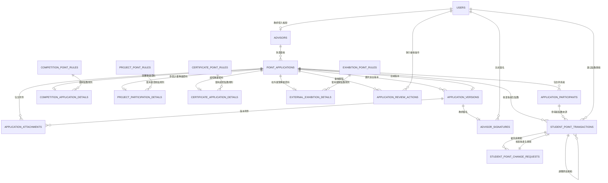

# 資料模型

本文件描述 PostgreSQL 邏輯資料模型、各資料表用途、欄位與關聯。共用 PostgreSQL 設計原則請參考 [Schema 設計規範](schema-conventions.md)；完整 SQL 請參考 [資料庫 Schema](database-schema.md)；點數計算、規則與流水帳請參考 [點數系統](point-system.md)。

## 資料關聯總覽



## 使用者帳號 `users`

提供指導老師、承辦人與管理員登入系統。申請人不需要帳號，因此不會存在於這張資料表。

| 欄位 | 說明 |
| --- | --- |
| `id` | 主鍵 |
| `display_name` | 使用者顯示名稱，用於通知與稽核紀錄 |
| `email` | 登入帳號與系統通知信箱 |
| `password_hash` | 雜湊後的密碼，完成首次設定前可為 `NULL` |
| `role` | 使用者角色 |
| `is_active` | 帳號是否啟用 |
| `activation_token_hash` | 帳號啟用 Token 的雜湊值，可為 `NULL` |
| `activation_token_expires_at` | 帳號啟用連結到期時間，可為 `NULL` |
| `activated_at` | 完成首次帳號啟用的時間，可為 `NULL` |
| `password_reset_token_hash` | 密碼重設 Token 的雜湊值，可為 `NULL` |
| `password_reset_token_expires_at` | 密碼重設連結到期時間，可為 `NULL` |
| `last_login_at` | 最後登入時間，可為 `NULL` |
| `created_at` | 建立時間 |
| `updated_at` | 修改時間 |

`role` 預計值：

- `advisor`：指導老師
- `reviewer`：承辦人
- `admin`：系統管理員

資料規則：

- 每個帳號只能擁有一個角色。
- 系統可以存在多位指導老師及多位承辦人。
- 同一時間只能存在一位 `role = admin` 且 `is_active = true` 的管理員。
- 帳號不可刪除，只能停用，以保留歷史操作關聯。

帳號狀態判斷：

- `activated_at IS NULL`：尚未完成首次帳號啟用。
- `activated_at IS NOT NULL AND is_active = TRUE`：已完成啟用，目前可以登入。
- `activated_at IS NOT NULL AND is_active = FALSE`：曾經完成啟用，但後來被管理員停用。

## 指導老師 `advisors`

保存可供申請人從下拉選單選擇的指導老師資料，並將教師資料與登入帳號建立關聯。

| 欄位 | 說明 |
| --- | --- |
| `id` | 主鍵 |
| `user_id` | 關聯 `users.id`，且必須唯一 |
| `employee_number` | 教師編號，必須唯一 |
| `name` | 教師姓名 |
| `title` | 職稱 |
| `department` | 所屬系所或單位 |
| `is_director` | 是否為目前主任，預設為 `false` |
| `is_active` | 是否可被選擇，預設為 `true` |
| `created_at` | 建立時間 |
| `updated_at` | 修改時間 |

教師的登入及通知 Email 原則上使用 `users.email`，避免在 `advisors` 重複保存 Email。

教師離職、停職或暫時不可選擇時，應將 `is_active` 設為 `false`，而不是刪除教師資料，以保留歷史申請關聯。

主任仍使用指導老師帳號登入，`is_director` 只表示該教師目前兼任主任，不代表額外的審核角色。

帳號與身分關聯規則：

- `user_id` 必須為 `NOT NULL` 且唯一，確保每位指導老師都有對應的登入帳號，且一個帳號不會同時對應多位老師。
- 對應的 `users.role` 必須為 `advisor`，由 Service 層在建立及修改時驗證。
- 管理員建立指導老師時，必須在同一個 PostgreSQL Transaction 中完成 `users` 與 `advisors` 的建立，避免出現有 `users` 紀錄但缺少 `advisors` 對應的中間狀態。

主任資料規則：

- 系統同一時間最多只能有一位 `is_active = true` 且 `is_director = true` 的主任。
- 使用 partial unique index 限制只能存在一位啟用中的主任。
- 主任異動時，將舊主任的 `is_director` 設為 `false`，再將新主任設為 `true`，不可刪除舊主任資料。
- 主任異動兩步操作必須在同一個 PostgreSQL Transaction 中完成，避免短暫出現兩位主任或無主任的狀態。
- 申請核准後，系統使用主任所關聯的 `users.email` 寄送核准通知。
- 主任僅接收核准通知與備份，不需要再次核准或簽名。

下拉選單可被選的判斷條件：

申請表單只顯示同時符合下列條件的指導老師：

```sql
advisors.is_active = TRUE
AND users.is_active = TRUE
AND users.activated_at IS NOT NULL
```

未完成首次帳號啟用的教師即使 `advisors.is_active = true`，也不會出現在選單中，避免申請人選到無法簽名的老師。

建議索引：

```sql
CREATE UNIQUE INDEX one_active_director
ON advisors (is_director)
WHERE is_director = TRUE AND is_active = TRUE;
```

## 點數申請 `point_applications`

保存所有申請類型共用的核心資料。一筆資料代表一次完整的點數申請。

| 欄位 | 說明 |
| --- | --- |
| `id` | 主鍵 |
| `public_id` | 對外申請識別值，使用 UUID |
| `application_type` | 申請類型 |
| `status` | 目前申請狀態 |
| `advisor_id` | 關聯 `advisors.id` |
| `applicant_name` | 申請人姓名 |
| `applicant_email` | 申請人通知 Email |
| `applicant_phone` | 申請人聯絡電話 |
| `requested_total_points` | 所有參與者申請點數的加總 |
| `approved_total_points` | 所有參與者核准點數的加總，審核前為 `NULL` |
| `current_version_id` | 目前申請版本，關聯 `application_versions.id` |
| `edit_token_hash` | 補件連結 Token 的雜湊值，可為 `NULL` |
| `edit_token_expires_at` | 補件連結到期時間，可為 `NULL` |
| `submitted_at` | 首次送件時間 |
| `created_at` | 建立時間 |
| `updated_at` | 修改時間 |

### 申請類型

`application_type` 用來決定：

- 前端顯示哪一種申請表單。
- 後端使用哪一組欄位驗證與業務規則。
- 需要建立哪一張申請類型專屬資料。
- 審核頁面需要顯示哪些資訊。

目前預計類型：

- `competition`：競賽點數申請
- `certificate`：證照點數申請
- `project_participation`：參與計畫點數申請
- `external_exhibition`：參加校外展覽點數申請

`status` 可使用的值與狀態轉換規則請參考 [產品流程](product-workflows.md#申請狀態)。

## 申請參與者 `application_participants`

保存實際參與活動並取得點數的學生。系統不建立學生主資料庫，因此參與者資料全部由申請人手動填寫。

| 欄位 | 說明 |
| --- | --- |
| `id` | 主鍵 |
| `application_id` | 關聯 `point_applications.id` |
| `class_name` | 班級 |
| `student_number` | 學號 |
| `student_name` | 姓名 |
| `requested_points` | 申請人為此參與者填寫的申請點數 |
| `approved_points` | 承辦人核准的最終點數，審核前為 `NULL`，允許為 `0` |
| `is_applicant` | 是否為本次申請人 |
| `created_at` | 建立時間 |
| `updated_at` | 修改時間 |

資料規則：

- 每筆申請至少需要一位參與者。
- 每筆申請必須剛好有一位 `is_applicant = true` 的參與者。
- `is_applicant = true` 的 `student_name` 必須與 `point_applications.applicant_name` 一致。
- 同一筆申請內不能出現重複學號。
- `requested_points` 必須大於零。
- `approved_points` 審核前為 `NULL`，核准時必須大於或等於 `0`。
- 所有參與者的 `requested_points` 加總，必須等於 `point_applications.requested_total_points`。
- 所有參與者的 `approved_points` 加總，必須等於 `point_applications.approved_total_points`。
- 核准完成後，`approved_points` 不可再修改。

建議使用 partial unique index，限制每筆申請只能有一位申請人：

```sql
CREATE UNIQUE INDEX one_applicant_per_application
ON application_participants (application_id)
WHERE is_applicant = TRUE;
```

## 競賽申請資料 `competition_application_details`

保存只有競賽點數申請才會使用的資料，與 `point_applications` 為一對一關係。

| 欄位 | 說明 |
| --- | --- |
| `id` | 主鍵 |
| `application_id` | 關聯 `point_applications.id`，且必須唯一 |
| `competition_level_requested` | 申請人填寫的競賽等級 |
| `competition_level_other` | 申請人選擇其他競賽等級時填寫，可為 `NULL` |
| `competition_level_approved` | 承辦人最終認定的競賽等級，審核前為 `NULL` |
| `competition_level_approved_other` | 承辦人最終認定為其他競賽等級時填寫，可為 `NULL` |
| `competition_point_rule_id` | 送件時適用的競賽點數規則，關聯 `competition_point_rules.id` |
| `competition_name` | 競賽名稱 |
| `competition_category` | 競賽類別 |
| `award` | 獎項 |
| `award_other` | 選擇其他獎項時填寫，可為 `NULL` |
| `competition_date` | 競賽日期 |
| `created_at` | 建立時間 |
| `updated_at` | 修改時間 |

競賽等級預計選項：

- `international_integrated`：國際級整合
- `international_non_integrated`：國際級非整合
- `national_integrated`：全國性整合
- `national_non_integrated`：全國性非整合
- `other`：其他

選擇 `other` 競賽等級時，`competition_level_other` 必填；選擇其他競賽等級時，`competition_level_other` 必須為 `NULL`。

核准時，`competition_level_approved` 必須保存承辦人的最終認定等級。若最終認定為 `other`，`competition_level_approved_other` 必填；認定為其他等級時，`competition_level_approved_other` 必須為 `NULL`。

獎項預計選項：

- `first_place`：第一名
- `second_place`：第二名
- `third_place`：第三名
- `honorable_mention`：佳作
- `other_award`：其他獎項
- `finalist`：入圍
- `participation`：參賽

選擇 `other_award` 時，`award_other` 必填；選擇其他獎項時，`award_other` 必須為 `NULL`。

承辦人若只是依點數規則將競賽等級從申請人主張的 A 級認定為 B 級，可以直接填寫 `competition_level_approved` 並調整核准點數，不需要退回補件。原始申請等級與申請點數必須保留。

## 參與計畫申請資料 `project_participation_details`

保存參與計畫申請的專屬資料，與 `point_applications` 為一對一關係。

| 欄位 | 說明 |
| --- | --- |
| `id` | 主鍵 |
| `application_id` | 關聯 `point_applications.id`，且必須唯一 |
| `project_point_rule_id` | 送件時適用的薪資換點規則，關聯 `project_point_rules.id` |
| `project_name` | 計畫名稱 |
| `principal_investigator` | 計畫主持人 |
| `salary_start_month` | 領薪開始年月 |
| `salary_end_month` | 領薪結束年月 |
| `monthly_salary` | 薪資金額 |
| `work_description` | 工作概述 |
| `total_salary` | 領薪總金額，建議由系統計算 |
| `calculated_points` | 依規則計算出的參考點數 |
| `created_at` | 建立時間 |
| `updated_at` | 修改時間 |

資料規則：

- 一張申請只允許一位參與者，且該參與者必須是申請人。
- 一張申請只能包含一個計畫；不同計畫必須分開申請。
- `total_salary` 與 `calculated_points` 原則上由系統依規則計算，不由申請人手動輸入。
- 不同計畫的薪資不可合併後再計算點數；各計畫分別建立申請，核准後由學生點數流水帳依學號加總。

## 證照申請資料 `certificate_application_details`

保存取得證照申請的專屬資料，與 `point_applications` 為一對一關係。

| 欄位 | 說明 |
| --- | --- |
| `id` | 主鍵 |
| `application_id` | 關聯 `point_applications.id`，且必須唯一 |
| `certificate_point_rule_id` | 送件時適用的證照點數規則，關聯 `certificate_point_rules.id` |
| `certificate_name` | 證照名稱 |
| `issuing_organization` | 發照單位 |
| `certificate_number` | 證照編號 |
| `issued_date` | 證照日期 |
| `created_at` | 建立時間 |
| `updated_at` | 修改時間 |

資料規則：

- 一張證照固定申請 `2` 點。
- 申請點數應由系統自動設定，不由申請人手動輸入。
- 每位學生在整個在學期間，證照類別累積最高只能取得 `4` 點。
- 若學生證照類累積點數已達 `4` 點，本次證照申請不可核准。
- 每張證照固定 `2` 點，因此超過累積上限時不進行部分核准。

## 校外展覽申請資料 `external_exhibition_details`

保存參加校外展覽申請的專屬資料，與 `point_applications` 為一對一關係。

| 欄位 | 說明 |
| --- | --- |
| `id` | 主鍵 |
| `application_id` | 關聯 `point_applications.id`，且必須唯一 |
| `exhibition_point_rule_id` | 送件時適用的展覽點數規則，關聯 `exhibition_point_rules.id` |
| `exhibition_type` | 展覽類型 |
| `work_name` | 作品名稱 |
| `exhibition_name` | 展覽名稱選項 |
| `exhibition_name_other` | 選擇其他展覽時填寫，可為 `NULL` |
| `organizer` | 主辦單位 |
| `venue` | 展覽場地 |
| `start_date` | 展覽開始日期 |
| `end_date` | 展覽結束日期 |
| `created_at` | 建立時間 |
| `updated_at` | 修改時間 |

展覽類型預計選項：

- `creative_work`：創作作品
- `graduation_project_exhibition`：畢業專題展覽

展覽名稱預計選項：

- `campus_exhibition`：校內展
- `young_designers_exhibition`：青春設計節
- `vision_get_wild`：放視大賞
- `young_designers_exhibition_taiwan`：新一代設計展
- `a_plus_creative_festival`：A+ 創意季
- `moe_project_competition`：教育部專題競賽
- `other`：其他

選擇 `other` 時，`exhibition_name_other` 必填；選擇其他展覽名稱時，`exhibition_name_other` 必須為 `NULL`。

展覽日期拆分為 `start_date` 與 `end_date`，不要保存為日期範圍字串。

目前點數規則：

- 創作作品：每位參與者可申請 `0.5` 至 `1` 點。
- 畢業專題展覽：每位參與者可申請 `1` 至 `2` 點。
- 申請人填寫申請點數，承辦人可以在核准前調整最終核准點數。

## 申請附件 `application_attachments`

所有申請類型共用的附件資料表。一筆申請可以包含多個附件，附件不直接保存於各類型的專屬資料表。

附件不會在送出申請前單獨上傳或寫入資料庫。申請資料與附件會在同一次送出流程中建立；只有整份申請成功建立後，才會保存附件紀錄。因此第一版不需要暫存附件資料表或附件清理流程。

| 欄位 | 說明 |
| --- | --- |
| `id` | 主鍵 |
| `public_id` | 對外附件識別值，使用 UUID |
| `application_id` | 關聯 `point_applications.id` |
| `application_version_id` | 關聯 `application_versions.id`，表示附件屬於哪一版申請 |
| `attachment_type` | 附件類型，例如獎狀、證照或薪資證明 |
| `attachment_type_other` | 選擇其他附件類型時填寫，可為 `NULL` |
| `description` | 附件補充說明，可為 `NULL` |
| `original_filename` | 上傳時的原始檔名 |
| `storage_key` | 私有檔案儲存識別值 |
| `mime_type` | 檔案格式 |
| `file_size` | 檔案大小 |
| `uploaded_at` | 上傳時間 |

附件實體檔案放在私有儲存空間，資料庫只保存 `storage_key`。檔案必須經過登入及權限驗證後才能下載。

補件時可以保留舊版本附件；新上傳或保留至新版本的附件，應與新的 `application_version_id` 建立關聯。

附件類型預計值：

- `competition_rules`：競賽辦法
- `competition_poster`：競賽海報
- `official_website_screenshot`：官網截圖
- `official_document`：公文
- `participation_proof`：參賽證明
- `finalist_or_award_certificate`：入圍或獎狀
- `salary_proof`：薪資證明或薪資截圖
- `certificate_copy`：證照影本
- `exhibition_photo`：參加展覽照片
- `exhibition_poster`：展覽海報
- `other`：其他附件

選擇 `other` 時，`attachment_type_other` 必填；選擇其他附件類型時，`attachment_type_other` 必須為 `NULL`。`description` 可用於補充附件用途，例如「競賽官網得獎名單頁面」。

第一版允許的檔案格式：

- `application/pdf`
- `image/jpeg`
- `image/png`

第一版不允許 ZIP、RAR 等壓縮檔，避免無法預覽、內容格式難以控制、路徑穿越與壓縮炸彈等安全風險。

檔案限制與安全規則：

- 每筆申請最多 `10` 個附件。
- 每個檔案最多 `5 MB`。
- 上傳時必須同時檢查副檔名、MIME type 與實際檔案內容。
- 儲存時使用 UUID 重新命名，不直接使用原始檔名作為儲存路徑。

各申請類型最低附件要求：

- 競賽申請：`participation_proof` 或 `finalist_or_award_certificate` 至少一份。
- 參與計畫申請：`salary_proof` 至少一份。
- 證照申請：`certificate_copy` 至少一份。
- 校外展覽申請：`exhibition_photo` 至少一份。

## 審核操作紀錄 `application_review_actions`

保存每次同意、拒絕、要求補件、重新提交及核准操作。這張資料表是審核歷史紀錄，不只用於補件或拒絕。

| 欄位 | 說明 |
| --- | --- |
| `id` | 主鍵 |
| `application_id` | 關聯 `point_applications.id` |
| `actor_user_id` | 操作者帳號，關聯 `users.id`；申請人操作時可為 `NULL` |
| `actor_type` | 操作者類型 |
| `action_type` | 執行的審核動作 |
| `reason` | 補件與拒絕原因，其他操作可為 `NULL` |
| `metadata` | 審核調整的結構化資料，使用 PostgreSQL `JSONB` |
| `ip_address` | 操作來源 IP |
| `user_agent` | 操作使用的瀏覽器資訊 |
| `created_at` | 操作時間 |

`actor_type` 與 `action_type` 都是 `application_review_actions` 的欄位。下列項目是欄位可使用的值，不是獨立資料表或欄位。

`actor_type` 預計值：

| 值 | 說明 |
| --- | --- |
| `advisor` | 操作者是指導老師 |
| `reviewer` | 操作者是承辦人 |
| `applicant` | 操作者是沒有系統帳號的申請人 |
| `system` | 操作者是背景排程或系統自動流程 |

`action_type` 預計值：

| 值 | 說明 | `reason` 是否必填 |
| --- | --- | --- |
| `advisor_approved` | 指導老師簽名同意申請 | 否 |
| `advisor_rejected` | 指導老師拒絕申請 | 是 |
| `revision_requested` | 承辦人要求申請人補件 | 是 |
| `resubmitted` | 申請人完成補件並重新提交 | 否 |
| `reviewer_approved` | 承辦人核准申請 | 否，若包含調整則需填寫 |
| `reviewer_rejected` | 承辦人拒絕申請 | 是 |
| `reviewer_adjusted` | 承辦人調整申請認定或核准點數 | 是 |
| `revision_expired` | 申請人未於補件期限內重新提交，系統將申請作廢 | 是 |
| `advisor_confirmation_expired` | 指導老師於期限內未完成簽核，系統將申請作廢 | 是 |

例如 `reviewer_adjusted` 代表新增一筆審核操作紀錄，實際保存方式是：

```text
application_review_actions.action_type = reviewer_adjusted
```

系統不會建立名為 `reviewer_adjusted` 的資料表。

資料規則：

- `advisor_rejected`、`revision_requested`、`reviewer_rejected` 與 `reviewer_adjusted` 必須填寫 `reason`。
- 承辦人調整申請認定或核准點數時，建立 `reviewer_adjusted` 紀錄。
- `metadata` 可保存競賽等級、參與者點數及申請總點數的調整前後資料。
- 申請人重新提交時，`actor_type` 為 `applicant`，`actor_user_id` 為 `NULL`。
- 系統自動作廢申請時，`actor_type` 為 `system`，`actor_user_id` 為 `NULL`。
- 每次要求補件與重新提交都新增紀錄，不覆蓋舊紀錄。
- 承辦人不需要電子簽名，登入帳號、操作時間、IP 與瀏覽器資訊作為責任追蹤依據。
- 承辦人核准前，系統應顯示最終核准資料與確認畫面。
- 承辦人拒絕、要求補件或調整點數時，必須填寫原因。
- 申請核准後不可直接修改結果，只能透過點數流水帳新增調整或沖銷紀錄。

調整紀錄範例：

```json
{
  "adjustments": {
    "competitionLevel": {
      "requested": "A",
      "approved": "B"
    },
    "participants": [
      {
        "participantId": 10,
        "requestedPoints": 20,
        "approvedPoints": 10
      }
    ],
    "totalPoints": {
      "requested": 20,
      "approved": 10
    }
  }
}
```

## 申請版本 `application_versions`

保存申請每次正式送出時的完整內容。首次提交與每次補件重新提交，都會建立一筆新的版本紀錄。

| 欄位 | 說明 |
| --- | --- |
| `id` | 主鍵 |
| `application_id` | 關聯 `point_applications.id` |
| `version_number` | 此版本編號 |
| `application_snapshot` | 此版本送出時的完整申請資料，使用 PostgreSQL `JSONB` |
| `created_at` | 此版本建立時間 |

`application_snapshot` 是某個時間點的完整申請資料副本，預計包含：

- 申請人姓名、Email 與電話。
- 申請類型與該類型的專屬資料。
- 指導老師資料。
- 所有參與者的申請點數。
- 申請總點數。
- 附件資訊。

正常資料表保存目前最新內容；`application_versions` 則保存每次送出時的歷史內容，避免補件修改後覆蓋舊版本。

承辦人的核准點數與認定調整發生在申請送出之後，因此不寫入申請版本快照，而是保存於目前資料與 `application_review_actions` 審核紀錄。

資料規則：

- 首次送出時，建立 `version_number = 1` 的版本，並將 `point_applications.current_version_id` 指向該版本。
- 每次補件重新提交時，建立下一個 `version_number` 的版本，並將 `current_version_id` 更新為新版本的 ID。
- `current_version_id` 必須指向同一筆申請所擁有的版本紀錄。
- 同一筆申請不可有重複版本編號，應建立 `UNIQUE (application_id, version_number)`。
- 已建立的版本快照不可修改或刪除。
- 指導老師簽名必須關聯到特定申請版本。
- 建立或切換目前版本時，必須在同一個 PostgreSQL Transaction 中完成申請版本建立與 `current_version_id` 更新。

`current_version_id` 用來快速取得目前正在審核的完整版本紀錄；`application_versions.version_number` 則用來表示各歷史版本的順序。

### 目前版本關聯

`point_applications.current_version_id` 保存的是 `application_versions.id`，不是 `version_number`。它用來快速取得目前正在審核的完整版本；`version_number` 則表示同一申請內的歷史版本順序。

`current_version_id` 必須指向同一筆申請所擁有的版本。實際複合外鍵與首次建立 Transaction 請參考 [資料庫 Schema](database-schema.md#申請與版本的循環外鍵)。

## 指導老師簽名 `advisor_signatures`

保存指導老師每次同意申請時的簽名，以及老師所同意的特定申請版本。

| 欄位 | 說明 |
| --- | --- |
| `id` | 主鍵 |
| `application_version_id` | 關聯 `application_versions.id` |
| `advisor_user_id` | 簽名教師帳號，關聯 `users.id` |
| `signature_storage_key` | 私有簽名檔案的儲存識別值 |
| `signed_at` | 簽名時間 |
| `invalidated_at` | 簽名失效時間，可為 `NULL` |
| `invalidated_reason` | 簽名失效原因，可為 `NULL` |
| `ip_address` | 簽名操作來源 IP |
| `user_agent` | 簽名操作的瀏覽器資訊 |
| `created_at` | 建立時間 |

資料規則：

- 指導老師必須登入系統後才能簽名。
- 指導老師收到通知連結後，登入成功應直接導向指定申請的簽核頁面。
- 老師拒絕申請時不需要簽名，但必須填寫拒絕原因。
- 老師同意申請時，必須確認申請內容並完成簽名。
- 每次簽名建立新紀錄，不覆蓋舊簽名。
- 申請人完成補件後，舊簽名標記失效，老師必須對新版本重新簽名。
- `application_version_id` 用來證明老師簽名時實際同意的申請內容。
- 簽名板固定輸出 PNG，後端必須驗證實際檔案格式，並使用 `.png` 儲存。
- 簽名圖片屬於敏感資料，不應以公開靜態網址提供，必須透過權限驗證後存取。

`signature_storage_key` 不保存公開網址或作業系統絕對路徑。例如：

```text
signatures/applications/100/version-2/550e8400.png
```

後端會根據 Storage Key 從私有本機目錄、S3、MinIO 或其他物件儲存空間取得簽名檔案。
