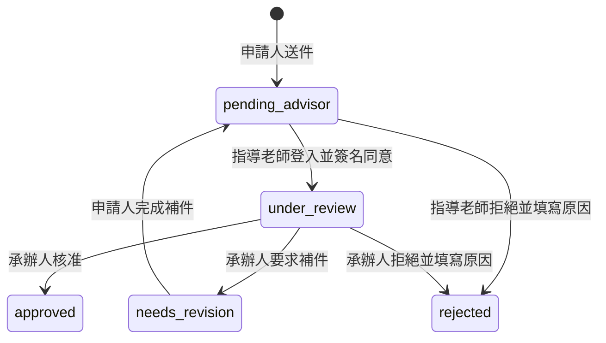

# 產品流程

本文件描述申請、簽核、補件、審核、逾期與點數異動的行為流程。相關資料表與欄位請參考 [資料模型](data-model.md)。

## 已確認的核心規則

- 申請人不需要登入即可填寫及送出申請。
- 申請人必須是申請中的其中一位參與者，其他人不得代為申請。
- 申請人送出後，不能自行修改或取消申請。
- 申請人的後續通知依賴姓名、Email 與電話。
- 申請人只能在承辦人要求補件後，透過限時補件連結修改申請。
- 補件時可以修改整份申請。
- 補件時沿用首次送件時保存的申請類型人數規則，不重新套用補件當下的新規則。
- 每次補件重新提交後，無論修改哪些欄位，都必須由指導老師重新簽名。
- 指導老師必須登入系統後才能簽名或拒絕申請。
- 指導老師由申請人從系統提供的下拉選單中選擇，不由申請人手動輸入。
- 指導老師與承辦人拒絕申請時，必須填寫原因。
- 申請被拒絕後，本次申請立即作廢；申請人若仍要申請，必須重新建立申請。
- 承辦人可以針對同一筆申請要求多次補件。
- 申請總點數由所有參與者的分配點數自動加總，不由申請人手動輸入。
- 申請參與者人數依首次送件時適用的申請類型人數規則驗證。
- 申請人填寫申請點數，承辦人可以在核准前調整最終核准點數，最低可調整為 `0`。
- 若申請事實資料有誤或證明不足，承辦人應要求補件；若只是承辦人依規則做出不同認定，可直接調整核准資料與點數。
- 承辦人調整核准資料或點數時，必須填寫調整原因並保留原始申請值。
- 系統不建立學生主資料庫；核准後的學生點數以學號作為識別值，保存於不可直接修改的點數流水帳。
- 承辦人不需要電子簽名；承辦人登入後可直接執行核准、拒絕、要求補件與調整，系統必須保存完整稽核紀錄。
- 承辦人核准申請後，系統寄送核准通知給申請人、指導老師與目前啟用中的主任，作為通知與留存備份。
- 系統允許多位承辦人使用自由搶案模式；不使用長時間應用層鎖，最終審核操作透過短時間資料庫 Transaction 與資料列鎖避免重複處理。
- 承辦人不可直接異動或沖銷核准後點數；承辦人必須提出點數異動申請，由管理員核准後才建立新的點數流水帳紀錄。


### 申請狀態

目前確認的狀態：

| 狀態 | 說明 |
| --- | --- |
| `pending_advisor` | 等待指導老師登入並簽名 |
| `under_review` | 指導老師已同意，等待承辦人審核 |
| `needs_revision` | 承辦人已要求補件，等待申請人重新提交 |
| `approved` | 已核准，終止狀態 |
| `rejected` | 已拒絕，終止狀態 |

第一版建議以 PostgreSQL `CHECK` constraint 限制狀態值，避免 PostgreSQL enum 在狀態仍可能調整時不易修改。

進入終止狀態 `approved` 或 `rejected` 時，必須同時寫入 `point_applications.closed_at`；其他進行中狀態的 `closed_at` 必須為 `NULL`。

### 補件 Token

`edit_token_hash` 與 `edit_token_expires_at` 只在承辦人要求補件時使用。

補件流程：

1. 承辦人要求補件，申請狀態改為 `needs_revision`。
2. 後端產生新的隨機 Token。
3. 資料庫只保存 Token 的雜湊值與到期時間。
4. 原始 Token 透過 Email 補件連結寄給申請人。
5. 申請人透過有效連結修改並重新提交整份申請。
6. 重新提交後清除補件 Token，避免重複使用。
7. 建立新的 `application_versions` 申請版本快照。
8. 將 `current_version_id` 更新為新版本的 ID。
9. 原有指導老師簽名失效。
10. 狀態回到 `pending_advisor`，等待指導老師重新簽名。

### 多承辦人自由搶案與併發控制

系統允許建立多位承辦人帳號，可用於交接、備援或多人共同處理待審申請。所有承辦人都可以查看待審申請，並採用自由搶案模式，不需要由管理員指派案件。

因為實務上通常只有一位承辦人，不使用需要 heartbeat、到期時間與強制解鎖的長時間應用層悲觀鎖。

承辦人可以同時開啟及查看同一筆待審申請，但最終送出核准、拒絕、要求補件或核准前調整時，必須使用短時間 PostgreSQL Transaction 與資料列鎖：

```sql
BEGIN;

SELECT *
FROM point_applications
WHERE id = $applicationId
FOR UPDATE;
```

取得資料列鎖後，系統必須重新驗證：

- 申請目前狀態仍允許執行該操作。
- 申請尚未被其他承辦人完成審核。
- 承辦人提交的核准資料仍符合目前申請內容與點數規則。

若兩位承辦人同時送出操作：

1. 第一位承辦人取得資料列鎖並完成操作。
2. 第二位承辦人等待鎖釋放後取得資料列鎖。
3. 第二位承辦人重新驗證時，會發現申請狀態已改變。
4. 系統拒絕第二次操作，並顯示申請已由其他承辦人處理。

這種設計只在最終寫入時鎖定資料列，不會在承辦人閱讀或填寫審核資料期間長時間占用資料庫連線。


## 自動通知與逾期作廢

Email 寄送失敗重試與尚未處理提醒是不同流程：

- 寄送失敗重試：Email 服務發生錯誤，由 Email Queue 自動重試。
- 尚未處理提醒：Email 已成功寄出，但老師或申請人尚未完成操作，由排程寄送提醒。

所有系統通知由 `email_tasks` 建立寄信任務，背景 worker 依 `scheduled_at` 寄送。寄送失敗重試只更新 `email_tasks` 狀態與嘗試次數，不等同於重新計算老師簽核或申請人補件期限。

若第一封正式通知永久失敗，系統不應直接視為老師或申請人已收到通知但未處理；第一版由管理員人工處理，不自動作廢申請，也不自動重算期限。

### 指導老師簽核提醒

申請送出並進入 `pending_advisor` 時，系統寫入 `point_applications.advisor_confirmation_expires_at` 作為指導老師簽核最後期限，並立即寄送第一次簽核通知。簽核提醒必須在期限前寄送；`advisor_confirmation_expires_at` 不是提醒時間。

老師簽核通知與提醒的 `email_tasks.event_key` 建議使用穩定格式，例如 `advisor-sign-request:application-{id}:version-{version}`、`advisor-sign-reminder-1:application-{id}:version-{version}` 至 `advisor-sign-reminder-3:application-{id}:version-{version}`。

系統自動寄送三次指導老師簽核提醒。超過 `advisor_confirmation_expires_at` 仍未簽核時，不再自動寄送簽核連結，系統改為作廢申請：

- 將申請狀態設為 `rejected`。
- 寫入 `point_applications.closed_at`。
- 新增 `advisor_confirmation_expired` 審核操作紀錄。
- `actor_type` 設為 `system`。
- 寄送申請作廢通知給申請人，必要時副本通知指導老師或承辦人。

提醒排程的實際間隔可由系統設定管理，但總提醒次數固定為三次。第一版不實作指導老師簽核期限延長；若未來需要，必須另行定義權限、通知與審核紀錄。

### 申請人補件提醒

補件期限為 `7` 天：

1. 承辦人要求補件後，系統立即寄送補件通知。
2. 到期前 `24` 小時，系統寄送一次補件提醒。
3. 到期仍未重新提交時，將申請狀態設為 `rejected`。
4. 寫入 `point_applications.closed_at`。
5. 清除 `edit_token_hash` 與 `edit_token_expires_at`。
6. 新增 `revision_expired` 審核操作紀錄，`actor_type` 設為 `system`。
7. 寄送申請作廢通知給申請人。

提醒信寄送失敗不會自動延長補件期限。

### 補件期限延長

第一版支援承辦人延長申請人的補件期限。延長期限只適用於仍在補件中的申請，不用來復原已作廢申請。

延長規則：

- 只能在 `status = 'needs_revision'` 時延長。
- 申請必須仍有有效的 `edit_token_hash` 與 `edit_token_expires_at`。
- 新的 `edit_token_expires_at` 必須晚於目前時間，也必須晚於原本的補件期限。
- 已經進入 `rejected` 的逾期作廢申請不可延長；申請人若仍要申請，必須重新建立申請。
- 延長期限不重新產生補件 Token，原補件連結繼續有效至新的期限。
- 承辦人必須填寫延長原因。
- 系統必須新增 `revision_extended` 審核操作紀錄，並在 `metadata` 保存原期限與新期限。
- 系統應建立補件期限延長通知 `email_tasks` 給申請人。


## 狀態轉換



`approved` 與 `rejected` 都是終止狀態，進入終止狀態時必須寫入 `point_applications.closed_at`。被指導老師或承辦人拒絕後，本次申請作廢，不能再次修改或補件。

## 多次補件與重新簽名流程

```text
under_review
-> 承辦人要求補件
-> needs_revision
-> 申請人修改整份申請並重新提交
-> 建立新的 application_versions 版本快照
-> current_version_id 指向新版本
-> 原指導老師簽名失效
-> pending_advisor
-> 指導老師重新登入並簽名
-> under_review
```

承辦人可以再次要求補件。每次補件都會建立新的補件 Token、審核操作紀錄及申請版本。

## 補件與承辦人直接調整的判斷

承辦人應根據修改內容區分處理方式。

### 需要退回申請人補件

- 競賽名稱、獎項或參與者等事實資料填寫錯誤。
- 缺少必要附件或證明資料。
- 申請內容與附件不一致。
- 承辦人無法根據目前資料完成判定。

申請人補件後，申請版本增加，原簽名失效，指導老師必須重新簽名。

### 承辦人可以直接調整

- 申請事實資料正確，但承辦人依規則做出不同的等級或點數認定。
- 例如申請人主張競賽等級為 A 級並申請 `20` 點，承辦人最終認定為 B 級並核准 `10` 點。

直接調整不需要重新要求指導老師簽名，但必須保留原始申請值、最終核准值、調整原因及操作人。
